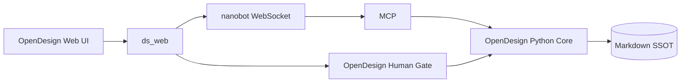
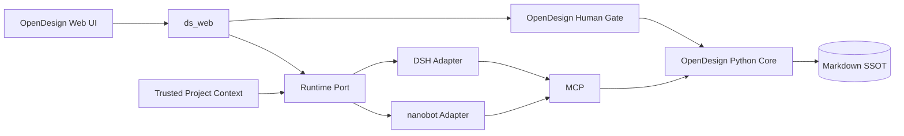

# DSH × OpenDesign 后续演进计划（Codex 独立方案）

> 作者：Codex
>
> 日期：2026-08-14
>
> 状态：**待 Claude 独立方案对抗的 proposal，不是实施授权**
>
> 证据快照：OpenDesign `3d73fb18a024988aec4276f9a1b176db2b70179e`；
> DeepSeek Harness `47f943859bef60e4160492346772ded9b24f765a`
>
> 范围声明：本文只讨论 **DeepSeek Harness（DSH）与 OpenDesign 产品运行时的关系**。
> `/root/aiwork` 只是现有开发过程：后续每一步继续走当前 track / oracle / review / verify 流程，
> **不修改 aiwork、不优化 track 工作流，也不把 aiwork 接进产品。**

## 结论先行

DSH 不应“接管 OpenDesign”，它只可能替换 OpenDesign 当前由 nanobot 承担的 **agent runtime** 部分。

正确的层级关系是：

```text
OpenDesign 产品
├── 领域真相：本地 Markdown PKB
├── 领域工具：ds_tools / ds_todo / ds_organize / ds_consent
├── 人类硬闸：OpenDesign Web 确认通道
├── 产品界面：ds_web + Web UI
└── Agent Runtime（可替换零件）
    ├── 当前：nanobot
    └── 候选：DeepSeek Harness

aiwork / track：在产品之外，只负责上述改动怎么开发、判卷和收货；保持不动。
```

我的建议是：

1. **现在不把 nanobot 直接换成 DSH。** DSH 仍是 developer preview，而且 Node/Windows 打包、现有 Web 协议和人类硬闸都有未知成本。
2. 先做一个不进 installer、不改产品数据的 **DSH headless sidecar spike**，证明它能调用 OpenDesign 现有 MCP 工具。
3. 只有 headless spike 通过，才让 nanobot 与 DSH 成为两个真实 Runtime Adapter，比较 session、恢复、项目 scope、硬闸和 Windows 交付。
4. DSH 若通过全部硬门，替换的是 nanobot runtime；OpenDesign 的 Markdown、领域核心、MCP 工具和人类硬闸不迁入 DSH。
5. DSH 若不通过，就保留 nanobot，只选择性借鉴已经被 spike 证明有净收益的 session/event 思路。

所以，之前那句可以更精确地改成：

> DSH 的 agent runtime 能力比 nanobot 更深，但它是否比 nanobot **更适合 OpenDesign**，现在证据不足；必须由 OpenDesign 自己的约束来判，而不是由框架功能表来判。

## 一、三者各自负责什么

| 层 | 拥有的责任 | 明确不拥有 |
|---|---|---|
| OpenDesign | 产品语义、Markdown SSOT、项目边界、领域工具、精确确认、Web UI、Windows 产品体验 | 通用 agent loop 的内部实现 |
| DSH | session/event、模型回合、tool lifecycle、scope、恢复、插件生命周期、MCP client | OpenDesign schema、业务权限最终裁决、用户文件真相 |
| nanobot | 当前已经工作的 agent runtime 与 WebSocket 协议 | 不因为“当前在用”就成为永久产品核心 |
| aiwork / track | 开发过程的规划、oracle、对抗、机器证据与收货 | 产品运行时、用户数据、runtime session |

`aiwork` 在本文唯一的作用是规定实施纪律：每个阶段单独开 track，按现有流程完成。本文没有任何 aiwork 改造任务。

## 二、OpenDesign 不允许 DSH 改写的边界

以下约束来自 [north-star.md](north-star.md) 与 [SCHEMA.md](../schema/SCHEMA.md)：

1. **Markdown 继续是产品真相源。** DSH session log 只能记录运行轨迹，不能替代 `clients/*.md`、`projects/*.md`。
2. **领域核心不依赖 DSH 类型。** `ds_tools.py`、`ds_todo.py`、`ds_organize.py`、`ds_consent.py` 继续是普通 Python 核心；DSH 通过 MCP 或窄 Adapter 调用。
3. **人类硬闸继续归 OpenDesign。** DSH approval/scope 可以提前拒绝，但不能代替模型不可触达的 Web 确认通道。
4. **项目 scope 由 OpenDesign 定义。** DSH 可以执行 scope，但无权自己猜当前项目，也不能只从 prompt 读取项目名。
5. **Windows 本地部署是产品约束。** DSH 的 Node runtime、包体、冷启动和离线安装成本必须接受这个约束，不能要求产品反过来适应框架。
6. **UI 不依赖 DSH 内部事件形状。** Web UI 消费 OpenDesign 定义的稳定事件投影，避免以后再次被某个 runtime 锁死。

## 三、DSH 真正值得 OpenDesign 借的部分

### 3.1 Session 与 append-only event

OpenDesign 当前前端在 `web/src/chat/transcript.ts` 中处理 hydration、reconcile 与流式事件，`ds_web.py` 又承担 nanobot proxy 和 WebSocket 生命周期。DSH 的 session/event 模型值得验证，因为它可能把以下事实统一到一条可重放日志：

- user/model message；
- turn start/end/cancel；
- tool call/result；
- approval pending/result；
- compaction 与恢复；
- interrupted/degraded/failed 状态。

但 DSH journal 只是真实的 **runtime trace**。设计师的项目记忆仍必须落到 Markdown；聊天记录不能偷偷成为第二个产品数据库。

### 3.2 Tool pipeline 与 scope

DSH 的 tool lifecycle、scope 和 MCP client 可能解决两类现有薄弱点：

- 工具调用可以经过统一的 runtime precondition，而不是每条调用路径各自判断。
- 项目会话可携带明确的 allowed tools / roots / capabilities，而不只是把 `【当前项目:X】` 拼进 prompt。

这里的关键不是“DSH 有 scope API”，而是它能否接收 **不可由模型伪造的 OpenDesign session context**。证明不了这一点，就不能把 scope 算成收益。

### 3.3 恢复与投影

DSH 若能在进程重启、WebSocket 断开、tool result 重复或 turn 未闭合时，从持久事件恢复一致状态，就有机会删除 OpenDesign 现有的部分 reconnect/reconcile 复杂度。

这是必须通过“删除测试”验证的收益：

> 接入 DSH 后，能够删除哪些 nanobot 专属恢复代码和状态拼接？如果删不掉，只是新增一套事件翻译层，就没有足够的架构收益。

### 3.4 插件生命周期

DSH 的插件生命周期适合承载 runtime 级能力，例如 provider、session persistence、MCP client、scope 和 checkpoint。它不适合把每个 OpenDesign 领域函数都改成 DSH plugin；那会让产品核心依赖候选底座，违反“换脑自由”。

## 四、不从 DSH 搬进来的东西

- 不开放 DSH 自带 file/shell 工具；OpenDesign 只暴露自己的受控工具面。
- 不把 Markdown schema 搬进 DSH event schema。
- 不让 DSH approval 直接执行 workspace/bind/organize。
- 不使用 DSH 自带 UI 替换现有 OpenDesign 工作台。
- 不因 DSH 使用 TypeScript/Node 重写 Python 领域核心。
- 不把 Cordis/plugin 结构铺满整个 OpenDesign 仓。
- 不跟随 DSH `main` 自动升级；若采用必须 pin 版本并有兼容性探针。
- 不长期维护 nanobot 与 DSH 两套默认路径；spike 结束必须 go/no-go。

## 五、目标 Seam：只替换 runtime

当前形状：



候选形状：



这里有一个重要顺序：**不能先造 Runtime Port。**

一个 Adapter 只能说明“以后也许能换”；两个真实 Adapter 才能证明 Seam 的共同 Interface 是什么。因此先做最薄的 DSH spike，拿 nanobot 和 DSH 的真实差异反推 Runtime Port：

- bootstrap / health；
- send / cancel / resume；
- session identity；
- normalized message/tool/approval events；
- trusted project context；
- degraded/failure reason。

Runtime Port 的 Interface 必须比两个 runtime 的完整能力交集更小，只包含 OpenDesign 真正消费的部分。不能为了“兼容所有 DSH 插件”把 DSH API 原样泄漏给 `ds_web`。

## 六、实施计划：全部沿用现有 track 流程

下面每个条目都是一个候选 track。`aiwork`、track 模板、review 入口和 guard 均保持现状，不在这些任务里修改。

### Track 0 — `opendesign-runtime-baseline`

目的：先冻结 nanobot 现状和 DSH 判题方式，不写 DSH 集成代码。

产物：

- OpenDesign 实际消费的 nanobot WebSocket / session / tool 协议清单。
- 10 个代表性产品任务与对应外部事实断言。
- 断线、重启、取消、重复 tool result、未闭合 turn 的故障题。
- 当前 Windows 安装、首次启动、冷启动、常驻内存、包体与离线依赖基线。
- MCP tool surface 与 OpenDesign 人类硬闸不可变量。
- DSH go/no-go 阈值，在跑 spike 前冻结，不能看结果后再调。

退出条件：所有题能在 nanobot 基线上复跑；SKIP 单列，不计 PASS。

### Track 1 — `opendesign-dsh-headless-spike`

目的：证明 DSH 能作为 OpenDesign 的“脑”，但不碰 UI、installer 和产品数据格式。

范围：

- 在独立 worktree/spike 目录 pin DSH 版本。
- 只接 OpenDesign 现有 MCP server；禁用 DSH 自带 file/shell。
- 使用临时 Markdown fixture，不指向真实用户工作区。
- 跑代表任务：list projects、append change、状态变更、日期解析、冲突追问、受控整理提案。
- 记录 session/tool event 是否足以还原模型看到和执行过的事实。

硬门：

- MCP surface 不得因 DSH 改名或泄漏额外工具。
- OpenDesign Python core 不 import DSH package/type。
- DSH 内部 approval 不得绕过 OpenDesign hard gate。
- event log 中不得落模型密钥或不必要的业主原文副本。

不通过：删除 spike，不开后续 Adapter track，nanobot 保持现状。

### Track 2 — `opendesign-runtime-adapter-spike`

前置：Track 1 PASS。

目的：让 nanobot 与 DSH 同时实现最小 Runtime Port，证明 Seam 真实存在。

范围：

- 只抽 bootstrap、send、cancel、resume、health 和 normalized events。
- 用同一份 Web transcript oracle 消费两个 Adapter。
- DSH event 投影必须兼容当前 UI 需要的信息，但不把 DSH event type 暴露进 React 组件。
- 给状态定义 `healthy / degraded / failed / off / unknown`，不能用一个 connected 布尔值吞掉资格差异。

删除测试：

- `ds_web.Handler` 不再包含 nanobot 专属消息拼装。
- `web/src/chat/transcript.ts` 不再判断 nanobot/DSH 供应商事件。
- 若接入后无法删除任何旧分支，此 track 应判为架构收益不足。

### Track 3 — `opendesign-runtime-project-scope`

前置：Track 2 PASS。

目的：证明 DSH 的 scope 能执行 OpenDesign 定义的项目边界。

先做 transport probe：从 Web session 到 runtime/tool call，是否能携带模型不可伪造的 project identity/capability？

故障题至少包括：

- prompt 伪造另一个项目名；
- 项目切换后重放旧 tool call；
- 两个项目会话并发；
- pending 期间 workspace root 改变；
- 同名目录被替换；
- DSH resume 后 scope 丢失。

如果 DSH/MCP 链路无法携带可信 context，此 track 必须 BLOCK。可另行设计项目级 capability 或独立 MCP endpoint，但不能拿 prompt 补洞。

### Track 4 — `opendesign-dsh-hard-gate`

前置：Track 2 PASS；可以与 Track 3 的设计串行协调，但不共享含糊状态。

目的：让 DSH tool lifecycle 与 OpenDesign 人类硬闸合作，而不是替代它。

推荐责任顺序：

```text
DSH scope/precondition
    → OpenDesign 生成 exact action + expected state
    → OpenDesign Web 展示
    → 人类批准/拒绝
    → OpenDesign 锁内复验
    → OpenDesign executor 执行
    → 结果作为 tool event 回到 DSH session
```

硬门：模型不能访问批准 endpoint、不能改 pending exact params、不能重复消费批准、不能在状态过期后照旧执行。DSH 的 session replay 不得重复产生外部副作用。

### Track 5 — `opendesign-dsh-windows-delivery`

前置：Track 1–4 全部 PASS。

目的：证明 DSH 在真实产品环境不是“开发机能跑”。

判题：

- 干净 Windows 机器离线/受限网络安装。
- Node runtime 的来源、pin、签名/校验与卸载。
- 首次启动、冷启动、常驻内存、包体、端口冲突、进程退出与升级。
- live process 自报 OpenDesign version、runtime kind/version、有效配置和 tool inventory fingerprint。
- 磁盘版本与运行版本不一致时明确 BLOCK，不能显示“已配置成功”。

任何一项超过 Track 0 预先冻结的预算，都要回到用户做产品取舍；不能由模型自行放宽。

### Track 6 — `opendesign-runtime-decision`

这个 track 只做证据汇总与裁决，不再补实现。

结论只能是：

- **GO**：DSH 成为默认 Adapter，nanobot 保留一个版本回退窗口；或
- **NO-GO**：删除 DSH 产品路径，保留 spike 结论，不继续双维护。

不能以“再观察一阵，所以两套都永久留下”收尾。

### Track 7 — `opendesign-dsh-migration`（仅 GO 后存在）

- 先切开发默认值，再切 Windows installer。
- Markdown schema、领域工具和人类硬闸不迁移。
- nanobot 回退窗口内，同一份 runtime oracle 必须双跑。
- 真机验收与 live identity 通过后，才删除 nanobot 专属路径。
- 删除旧路径本身要单独列清单，证明 DSH 带来了净复杂度下降。

## 七、DSH 的 go/no-go 判定

### 一票否决

以下任何一项失败，直接 NO-GO：

1. DSH 无法禁用无关 file/shell，或扩大了 MCP 工具面。
2. DSH scope 不能绑定可信 OpenDesign 项目上下文。
3. session replay/cancel/recovery 可能重复执行已批准动作。
4. DSH approval 会替代或绕过 OpenDesign 人类硬闸。
5. DSH 要求修改 Markdown SSOT 或让 Python core 依赖 DSH。
6. Windows 安装与运行达不到预先冻结的产品预算。
7. developer preview 的升级无法 pin、无法检测兼容性、无法回退。

### 比较维度

硬门全过后，再比较：

| 维度 | 要回答的问题 |
|---|---|
| 会话正确性 | 重启、断流、取消和未闭合 turn 后，能否重建一致事实？ |
| 项目隔离 | 跨项目恶意题是否由服务端/runtime 拒绝，而非依赖 prompt？ |
| 硬闸完整性 | 精确参数、旧状态复验、一次性与结果回写是否闭环？ |
| 代码净变化 | 删除的 nanobot/reconnect/protocol 复杂度是否多于新增 Adapter？ |
| Windows 体验 | 安装、启动、资源、升级、卸载是否仍符合单机产品？ |
| 维护风险 | pin 与兼容性探针能否隔离 DSH preview 漂移？ |

“DSH 功能更多”不算得分；只有 OpenDesign 实际消费并能删除旧复杂度的能力才算。

## 八、与 OpenDesign 其他优化项的关系

[backlog.md](backlog.md) 中的 PKB 崩溃原子写、陈旧写保护等仍然重要，但它们是 **OpenDesign 自身的数据安全 track**，不属于 DSH 选型，也不应拿来支持“迁 DSH”或“留 nanobot”的结论。

两条路线可以分别排期，但必须保持因果清楚：

- DSH 路线回答“谁来承担 agent runtime”。
- PKB/领域路线回答“无论哪个 runtime 调用，OpenDesign 如何安全地保存产品事实”。

本文不替后者重新排优先级。

## 九、给 Claude 的独立对抗题

为了得到真正独立的方案，先让 Claude 读取 OpenDesign、DSH 官方仓和当前 track 流程，但不要先读本文结论。让它写到 `docs/opendesign-optimization-plan-claude.md` 后再互相开放。

固定攻击点：

1. DSH 是否真的只应作为 runtime Adapter，还是它应该承担更多/更少？
2. headless → Adapter → scope/hard-gate → Windows 的顺序哪里不对？
3. 哪些 DSH event/tool 能力在 OpenDesign 里没有真实消费者？
4. Runtime Port 是否仍然过早；怎样的第二实现证据才足以建立 Seam？
5. DSH scope 能否解决可信项目上下文，还是我高估了它？
6. DSH session replay 对有外部副作用的工具有哪些重复执行风险？
7. Windows/Node 成本应该是哪一级硬门？
8. 如果最终 NO-GO，哪些 spike 产物仍值得保留，哪些必须删除？

最终由用户主裁；两个模型的多数意见不是证据。

## 参考材料

- OpenDesign：[north-star.md](north-star.md)、[backlog.md](backlog.md)、[SCHEMA.md](../schema/SCHEMA.md)、`bin/ds_mcp.py`、`bin/ds_web.py`、`bin/ds_consent.py`、`bin/ds_organize.py`、`web/src/chat/transcript.ts`。
- DeepSeek 官方：[deepseek-ai/deepseek-harness](https://github.com/deepseek-ai/deepseek-harness/tree/47f943859bef60e4160492346772ded9b24f765a)、[Architecture](https://github.com/deepseek-ai/deepseek-harness/blob/47f943859bef60e4160492346772ded9b24f765a/docs/architecture.md)、[Persistence Catalog](https://github.com/deepseek-ai/deepseek-harness/blob/47f943859bef60e4160492346772ded9b24f765a/docs/persistence-catalog.md)。
